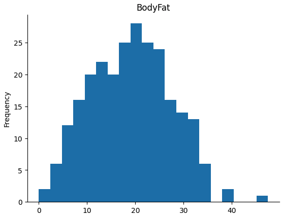
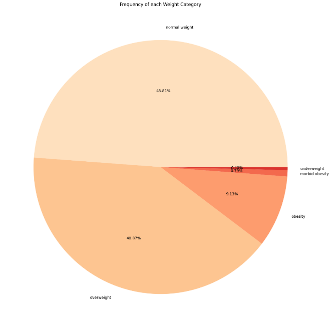
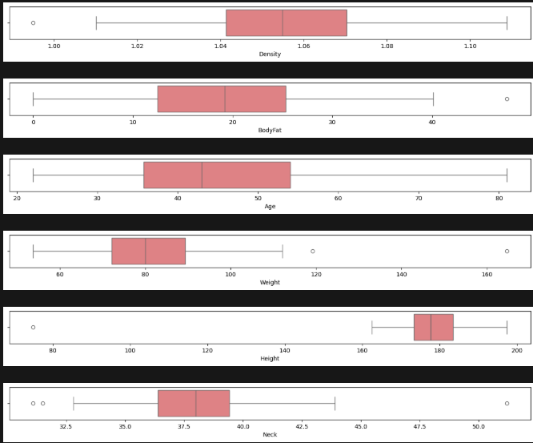

# Body Fat Prediction Analysis Project

## Project Description

This project consists of a comprehensive analysis and prediction of body fat percentage from anthropometric measurements. The objective is to develop machine learning models capable of accurately predicting an individual's body fat percentage based on simple body measurements.

## Objectives

- Analyze correlations between different body measurements and body fat percentage
- Develop and compare multiple machine learning models
- Identify the most important features for prediction
- Provide insights on factors influencing body composition

## Dataset

The dataset contains **252 observations** with **15 features**:

### Main Features:
- **Density**: Body density
- **BodyFat**: Body fat percentage (target variable)
- **Age**: Age in years
- **Weight**: Weight in kg (converted from pounds)
- **Height**: Height in cm (converted from inches)
- **Neck**: Neck circumference in cm
- **Chest**: Chest circumference in cm
- **Abdomen**: Abdomen circumference in cm
- **Hip**: Hip circumference in cm
- **Thigh**: Thigh circumference in cm
- **Knee**: Knee circumference in cm
- **Ankle**: Ankle circumference in cm
- **Biceps**: Biceps circumference in cm
- **Forearm**: Forearm circumference in cm
- **Wrist**: Wrist circumference in cm

### Derived Features:
- **BMI**: Calculated Body Mass Index

## Data Preprocessing

### 1. Unit Conversion
- Conversion from inches to centimeters for height
- Conversion from pounds to kilograms for weight

### 2. Multicollinearity Management
- Removal of `Density` column (too correlated with `BodyFat`)
- Identification and removal of highly correlated features (>0.8)
- Application of a penalty system to eliminate redundancies

### 3. Normalization
- Application of square root transformation on the `Age` variable to improve distribution

## Exploratory Data Analysis

### Main Visualizations:

#### 1. Body Fat Distribution

*Histogram showing the distribution of body fat percentage across the dataset*

#### 2. Body Fat vs Age Correlation

*Scatter plot demonstrating the correlation between body fat percentage and age*

#### 3. BMI Weight Categories

*Pie chart showing the distribution of weight categories based on BMI classification*

#### 4. Correlation Heatmap

*Heatmap displaying correlations between all features in the dataset*

#### 5. Feature Correlation with BodyFat

*Bar chart showing correlation between each feature and body fat percentage*

#### 6. Boxplots for Outlier Detection

*Boxplots for each feature to identify outliers and data distribution*

### Key Insights:
- Strong correlation between body measurements
- Abdomen and chest are the variables most correlated with body fat
- Presence of multicollinearity requiring data cleaning

## Machine Learning Models

### Tested Models:
1. **Linear Regression**
2. **Random Forest Regressor**
3. **XGBoost Regressor**
4. **CatBoost Regressor**
5. **LightGBM Regressor**
6. **Extra Trees Regressor**
7. **Decision Tree Regressor**
8. **Support Vector Regressor**

### Hyperparameter Optimization:
- **Random Forest**: GridSearchCV with 81 combinations
- **XGBoost**: GridSearchCV with 243 combinations
- **CatBoost**: GridSearchCV with 27 combinations

## Model Results

### Best Model: **CatBoost Regressor**

| Metric | Value |
|--------|-------|
| **R² Score** | 0.67 |
| **MAE** | 3.26 |
| **RMSE** | 3.92 |
| **MSE** | 15.37 |

### Performance Comparison:
1. **CatBoost**: R² = 0.67, MAE = 3.26
2. **Random Forest**: R² = 0.67, MAE = 3.26
3. **XGBoost**: R² = 0.65, MAE = 3.30
4. **Linear Regression**: R² = 0.54, MAE = 3.43

## Model Interpretability

### SHAP Analysis (SHapley Additive exPlanations):

#### Feature Importance

*Bar chart showing the importance of each feature in the model*

- **Most Important Variables**: Abdomen, Chest, Hip, Weight
- **Dependence Plots** for the 5 most important variables
- **Clustering** of SHAP values to identify behavior groups

### Most Influential Features:
1. **Abdomen**: Most predictive variable
2. **Chest**: Strong correlation with body fat
3. **Hip**: Important for prediction
4. **Weight**: Significant influence
5. **BMI**: Useful composite indicator

## Technologies Used

- **Python**: Main language
- **Pandas**: Data manipulation
- **NumPy**: Numerical computations
- **Matplotlib/Seaborn**: Visualizations
- **Scikit-learn**: Machine learning models
- **XGBoost**: Gradient boosting
- **CatBoost**: Optimized gradient boosting
- **LightGBM**: Fast gradient boosting
- **SHAP**: Model interpretability

## Conclusions

- The CatBoost model achieves satisfactory performance with an R² of 0.67
- Abdomen and chest measurements are the most predictive
- Multicollinearity between variables was effectively managed
- SHAP analysis provides valuable insights on feature importance

## Author

Project completed as part of academic studies, Data analysis and machine learning applied to health.

